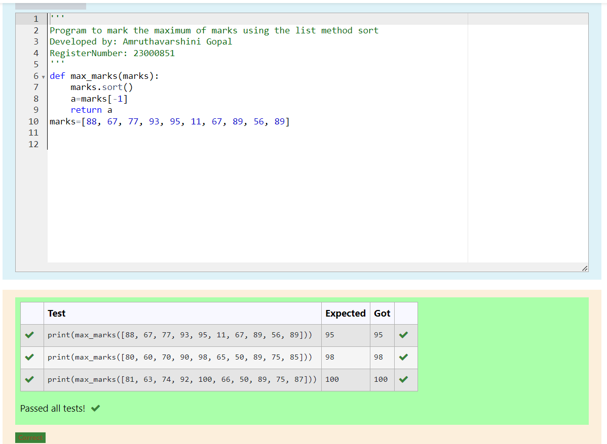
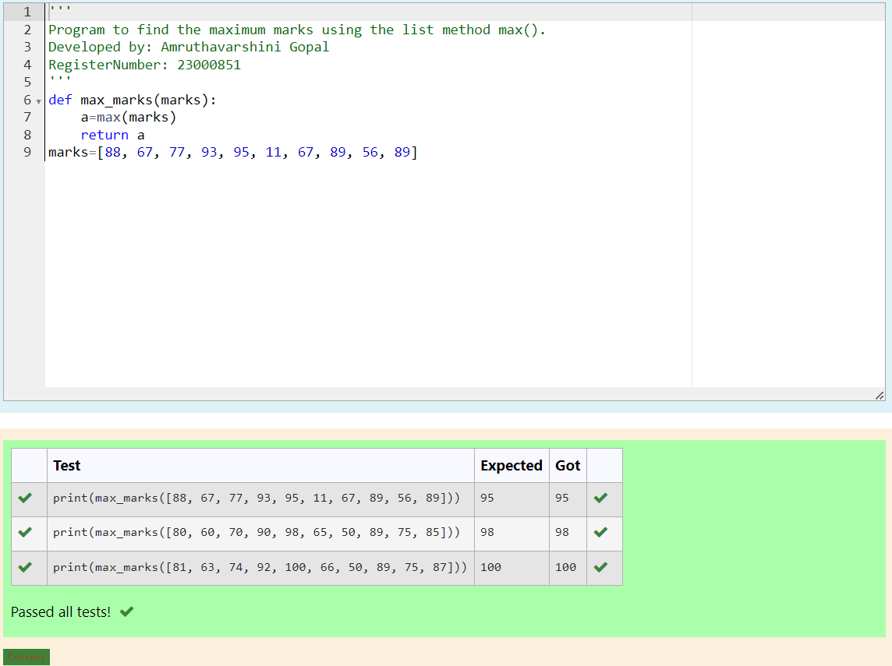
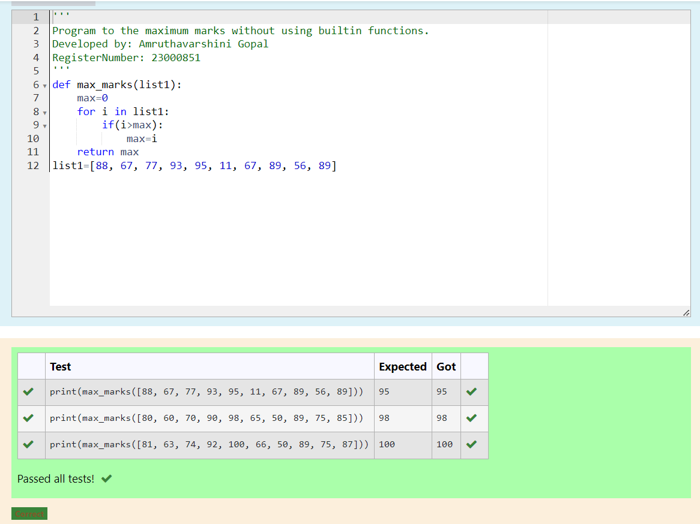

# Find the maximum of a list of numbers

Name: Amruthavarshini Gopal

Register number: 23000851

Department: AIDS

## Aim:

To write a program to find the maximum of a list of numbers.

## Equipment’s required:

1.	Hardware – PCs
2.	Anaconda – Python 3.7 Installation / Moodle-Code Runner

## Algorithm:

1.	Get the list of marks as input

2.	Use the sort() function or max() function or use the for loop to find the maximum mark.

3.	Return the maximum value

## Program:

i)	# To find the maximum of marks using the list method sort.
```
''' 
Program to mark the maximum of marks using the list method sort
Developed by: Amruthavarshini Gopal
RegisterNumber: 23000851
'''
def max_marks(marks):
    marks.sort()
    a=marks[-1]
    return a
marks=[88, 67, 77, 93, 95, 11, 67, 89, 56, 89]
```

ii)	# To find the maximum marks using the list method max().
```
''' 
Program to find the maximum marks using the list method max().
Developed by: Amruthavarshini Gopal
RegisterNumber: 23000851
'''
def max_marks(marks):
    a=max(marks)
    return a
marks=[88, 67, 77, 93, 95, 11, 67, 89, 56, 89]
```

iii) # To find the maximum marks without using builtin functions.
```
''' 
Program to the maximum marks without using builtin functions.
Developed by: Amruthavarshini Gopal
RegisterNumber: 23000851
'''
def max_marks(list1):
    max=0
    for i in list1:
        if(i>max):
            max=i
    return max
list1=[88, 67, 77, 93, 95, 11, 67, 89, 56, 89]
```

## Sample Input and Output:


## Output:

(i) #To find the maximum of marks using the list method sort.



(ii) #To find the maximum marks using the list method max().



(iii) #To find the maximum marks without using builtin functions.



## Result:

Thus the program to find the maximum of given numbers from the list is written and verified using python programming.